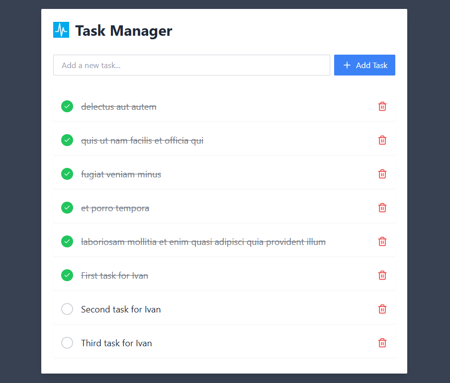

# Task Manager




## Getting Started

1. Clone the repository
   ```bash
   git clone https://github.com/crisps0914/task-manager.git
   cd task-manager
   ```
2. Install dependencies:
   ```bash
   npm install
   ```
3. Start the development server:
   ```bash
   npm run dev
   ```
    It'll be run http://localhost:5173/

## Available Scripts

- `npm run dev` - Start development server
- `npm run build` - Build for production
- `npm run test` - Run unit tests
- `npm run storybook` - Start Storybook development server
- `npm run build-storybook` - Build Storybook for deployment

## Technologies Used

- React
- TypeScript
- Redux Toolkit
- Tailwind CSS
- Framer Motion (Animation)
- Axios
- Storybook
- Vitest
- Testing Library